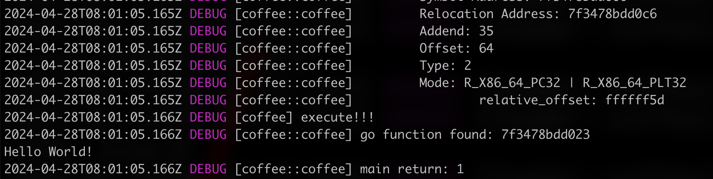

# Coffee

Coffee is a loader for ELF (Executable and Linkable Format) object files written in Rust. It provides a mechanism to load and parse ELF files similar to COFFLoader, but specifically designed for ELF files used in Unix-like systems.

**Note: This project is currently under active development and only supports a subset of architectures at the moment.**

## Features

- Dynamic Loading of Object Files
  - The loader allows dynamic loading of `.o` files at runtime. You can load object files dynamically and access both the functions defined within the loader and the functions defined in Rust.
- Customizable Symbol Resolution
  - The loader provides the flexibility to customize the symbol resolution mechanism. You can define your own symbol resolution strategy based on your specific requirements. This allows you to handle symbol resolution in a way that best fits your project's needs.
- Easy Addition of Built-in Functions
  - The loader allows easy addition of built-in functions, which can be called from within the loaded object files. You can extend the loader's functionality by adding new functions that are readily available for use in the object files. This simplifies the process of adding and invoking custom functions within the loaded ELF files.
- Support GLIBC Look up
  - The loader supports GLIBC look up for symbols. It can resolve symbols from the GLIBC library and provide access to the functions defined in the GLIBC library. This allows you to use GLIBC functions within the loaded object files without any additional configuration.
## Usage

1. Clone the project

```bash
git clone https://github.com/Sndav/coffee
```

2. Compile the C source file to `.o` file

```bash
gcc -c test.c -o test.o
```

3. Run the project

```bash
cargo run <path_to_obj_file>
```


## Support

- [x] x86_64
  - [x] R_X86_64_64
  - [x] R_X86_64_PC32
  - [x] R_X86_64_PLT32
- [x] X86
  - [x] R_X86_64_64
  - [x] R_X86_64_GOTPCREL
- [x] ARM
- [x] ARM64

## Advanced

### Add custom function

1. Define the function in rust

```rust
pub extern "C" fn hello_world() {
    println!("Hello, world!");
}
```

2. Register the function

```rust
let mut coffee = Coffee::new(&file_data)?;
coffee.register_symbol("hello_world", hello_world as *const c_void);
```

3. Define the function prototype in C source file

```c
void hello_world();

int main(){
    hello_world();
    return 1;
}
```

4. Compile the file

```bash
gcc -c hello_world.c
```

5. Load the file

```bash
cargo run ./test/hello_world.o
```

